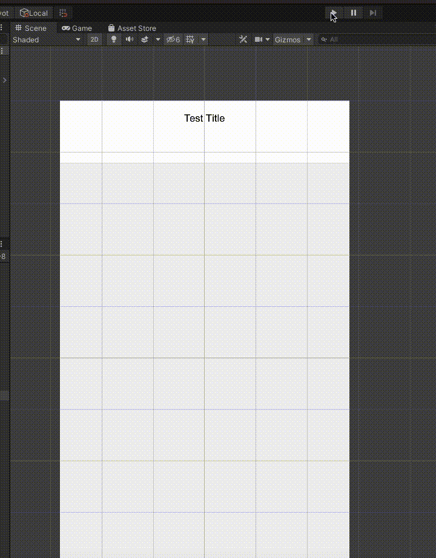
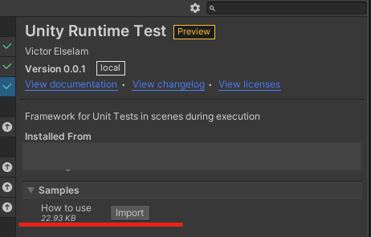

# unity-runtime-test

This is a Unit Test Framework built with Unity Scenes, so we have all features of Unity available, we can use it in Mobile Builds and has support for async methods. 
It's based on NUnit implementation, however, it's still much more limitated. 
I plan to keep improving and investing effort in this framework, some of my next steps are:

# Install

- In the Unity package manager window, you can add package from git url like "https://github.com/dev-victorelselam/unity-runtime-test.git?path=/Assets/Package"

or 

- (Work in progress)Using subtree "upm" with https://github.com/mob-sakai/UpmGitExtension. Add "https://github.com/dev-victorelselam/unity-runtime-test.git" and select releases 

# Nexts Steps

- Create a system that can play tests in sequence and provide a file/window with the result report
- Create a shortcut allowing us to run tests on builds with this automated system
- A configurable object to allow send those reports over a custom server
- Improve the assert options and interactions
- Better UI
- Add auto-fill in TestPrefab inspector fields
- New examples for all new features
- Improve documentation

# Get Started

1. Drag TestPrefab to a new scene
2. Assign the inspector fields
3. Create a new c# script that inherit from AssertMonoBehaviour
4. Do the Asserts in Awake method, just like the examples

# Sample 

You can download sample for use UI Canvas prefabs

## Special Requirements
I encourage you to extend the AssertMonoBehaviour with your own needs, for that, Setup() method is virtual.
So you can override it's initialization and create the default setups for your project, like a Context, for example.

